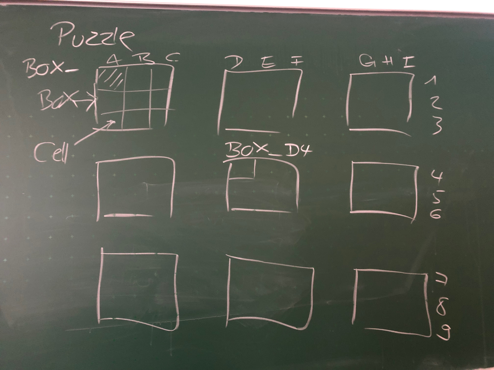

# SudokuSolverTCP
A distributed Sudoko solver via constraint propagation over TCP.

## Defining the Interface

Zusätzlich zu den im Bild angegebenen Namen für Boxen versteht der Manager positionsbasierte Namen:

BOX_UL BOX_UM BOX_UR
BOX_ML BOX_MM BOX_MR
BOX_LL BOX_LM BOX_LR

### Process Arguments

- Which box (e.g. BOX_A1, BOX_D4, ...)
- Initial setting (list of xy:v with x between 0 and 2 (column) and y between 0 and 2 (row) and value v, separated by comma)
- Manager address (URI): tcp://host:port

### Message Format

Der Manager erwartet UTF-8 als Zeichensatz für alle empfangenen Nachrichten und versendet auch in diesem Zeichensatz.

#### Box -> Manager (Anmelden)
Box nennt Boxnamen sowie IP-Adresse und Portnummer, unter der sie erreichbar ist: BOX_D4,127.0.0.1,4233.

Der Manager analysiert die Nachricht und schickt entsprechende Fehlermeldungen an den Absender zurück. Der Manager läßt ab sofort nur gültige Boxnamen zu; der übermittelte Boxname wird zu diesem Zweck intern immer in Großbuchstaben dargestellt und gespeichert. Der Manager läßt auch keine Anmeldungen für eine Box zu, für die schon eine Registrierung vorliegt.

Außerdem versteht der Manager eine Test-Registrierung mit dem Boxnamen TEST, z.B. "TEST,127.0.0.1,4242". Der Manager überprüft diese Testnachrichten ganz normal und gibt im Fehlerfall die entsprechende Meldung zurück bzw. OK, eine Registrierung dieser Verbindung findet jedoch nicht statt, insbesondere wird die TCP-Verbindung dabei wie im Fehlerfall geschlossen.

#### Box -> Manger (Query)
Eine Box will die Adresse einer anderen Box wissen:
- Query: Boxname
- Antwort: IP-Adresse bzw DNS-Name, Portnummer
Die Antwort wird verzögert, bis dem BoxManager alle 9 Boxen bekannt sind!

Anfragende Box wartet auf die Antwort und macht anschließend ein Connect an die übermittelte Adresse.

#### Box -> Manager (Finished)
Alle Zellen in der Box sind besetzt. Die Box schickt das gesamte Ergebnis an den Manager. Um diese Nachricht einfach von einer Query zu unterscheiden, muß die Box diese Nachricht mit dem konstanten String RESULT beginnen: "RESULT,Boxname,1,4,3,2,6,7,5,9,8" (von links oben zeilenweise nach rechts unten).

Der Manager terminiert, wenn er von allen 9 Boxen eine RESULT-Nachricht erhalten hat. Vorher gibt er das Gesamtergebnis - im Moment noch etwas häßlich - am Terminal aus.

#### Manager/Box -> Box (Feierabend)
Nachricht enthält den konstanten String "FEIERABEND". Eine Box, die FEIERABEND schickt den FEIERABEND an alle ihr bekannten Nachbarboxen und terminert anschließend selber.

#### Box -> Box (Neues Wissen)
Box schickt eine Nachricht, wenn sie eine ihrer Zellen mit genau einer Ziffer belegen kann. Es gibt absolute und relative Wissensnachrichten:
- Boxname, relative Spalte, relative Zeile: BOX_D4,0,1:7
- Absolute Koordinate und Wert: D5:7

Eine Box schickt neues Wissen an alle mit ihr direkt verbundenen Nachbarboxen.
